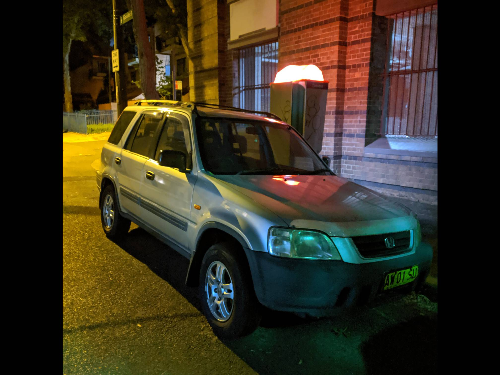
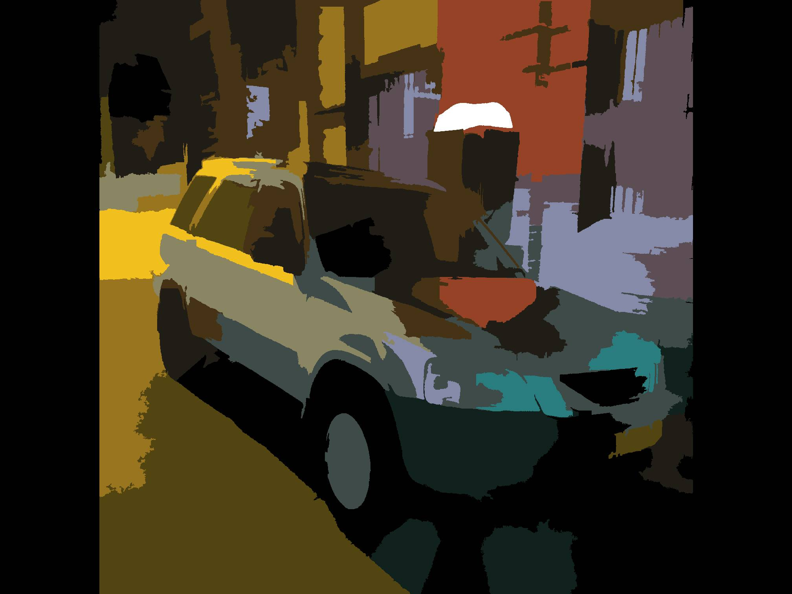
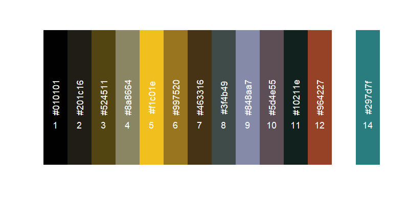
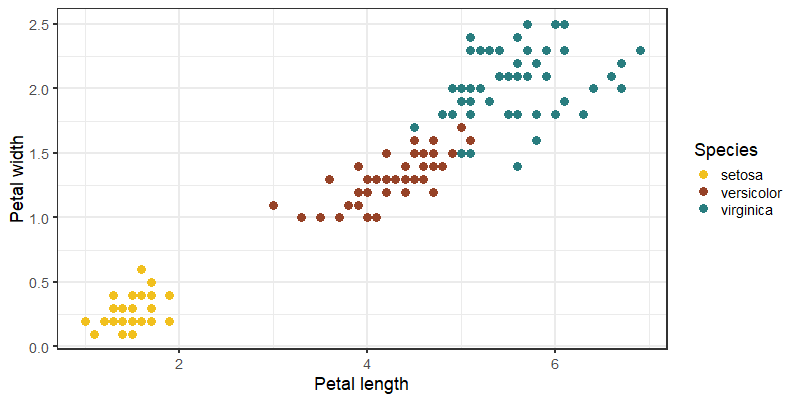

<!-- badges: start -->
[](https://cran.r-project.org/package=schemr)
[](https://cran.r-project.org/package=schemr)
[](https://github.com/stuart-morrison/schemr/actions/workflows/R-CMD-check.yaml)
<!-- badges: end -->


:rainbow: `schemr` package
================


Convert photos into useable colour schemes
------------------------------------------

`schemr` is an R package for turning your photos into usable colour
schemes for R visualisations.

The key driver is the `image_to_pallette` function, which:

-   reads in images;
-   finds colour blobs within the image, representing the key
    highlighting colours; and
-   uses affinity propagation clustering to condense the set of key
    colours.

### :hammer: Installing `schemr`

Install the latest CRAN version of `schemr` by:
``` r
install.packages("schemr")
```

Alternatively, install the development version of `schemr` can be installed by running:
``` r
devtools::install_github("stuart-morrison/schemr")
```

### :camera: Photo example

First we have a look at a photo of my beautiful old car.

``` r
library(OpenImageR)
library(magrittr)

# Read in the image
image <- readImage(path = "images/car.jpg")

# Shrink down the image - Note resizeImage width and height are on array dimensions, rather than on image dimensions
new_height <- dim(image)[1] * 0.5
new_width <- dim(image)[2] * 0.5
image %<>% resizeImage(image = ., width = new_height, height = new_width)

# Plot
plot(as.raster(image))
```



We see big blobs of blue, yellow and orange. Using schemr to extract these, we
get:

``` r
library(schemr)

# Extract key colours from image
# I use the median to extract the centre of each 'blob' - but any function summary function, eg, mean, max, min, will all work
schemr_data <- image_to_pallette(image_path = "images/car.jpg", resize_factor = 0.5,
                                  verbose = FALSE, summary_method = median)

# Plot the image
plot(schemr_data)
```



We can see the palette of colours found in the image by using the `palette` method on the schemr data.

``` r
palette(schemr_data)
```


In addition, printing the class, shows the vector of hex RGB codes that
make up the clustered data:

``` r
schemr_data
```

    ## [1] "#010101" "#201c16" "#524511" "#8a8664" "#f1c01e"
    ## [6] "#997520" "#463316" "#3f4b49" "#848aa7" "#5d4e55"
    ## [11] "#10211e" "#964227" "#ffffff" "#297d7f"

### :bar_chart: Using `schemr` palettes in plots

The evaluated palette is easy to apply immediately into data visualisation by access through the `palette` attribute.

``` r
library(ggplot2)
# Example plot using the iris data set
ggplot() +
    geom_point(data = iris,
               aes(x = Petal.Length, y = Petal.Width,
                   col = Species),
               size = 4) +
    scale_color_manual(name = "Species",
                       values = schemr_data$palette[c(5, 12, 14)]) +
    labs(x = "Petal length", y = "Petal width") +
    theme_bw(base_size = 18)
```


### :raised_hands: Colour space conversions

`schemr` also contains functions to convert colour data both to and
from the following colour spaces:

|From\To|         RGB         |         XYZ         |         Lab         |         HSL         |         HSV        |
| ---:  |        :---:        |        :---:        |        :---:        |        :---:        |        :---:       |
|  RGB  |                     | :white_check_mark:  | :white_check_mark:  |  :white_check_mark: | :white_check_mark: |
|  XYZ  | :white_check_mark:  |                     | :white_check_mark:  |  :white_check_mark: | :white_check_mark: |
|  Lab  | :white_check_mark:  | :white_check_mark:  |                     |  :white_check_mark: | :white_check_mark: |
|  HSL  | :white_check_mark:  | :white_check_mark:  | :white_check_mark:  |                     | :white_check_mark: |
|  HSV  | :white_check_mark:  | :white_check_mark:  | :white_check_mark:  | :white_check_mark:  |                    |


Colour conversion constants and functions are provided for sRGB and
Adobe 1998 RGB spaces, with user ability to apply other conversions for
other RGB spaces.

For example, using excellent colours from the
[`wesanderson`](https://github.com/karthik/wesanderson) package:

``` r
library(wesanderson)

# Extract some lovely Zissou colours
colour_hex <- wes_palettes$Zissou1

# Convert to Lab space
colour_lab <- hex_to_lab(hex = colour_hex, transformation = "Adobe")

# Convert Lab space to XYZ space
colour_xyz <- lab_to_xyz(lab = colour_lab)

# Convert XYZ space to RGB colour channels
colour_rgb <- xyz_to_rgb(xyz = colour_xyz, transformation = "Adobe")
```
