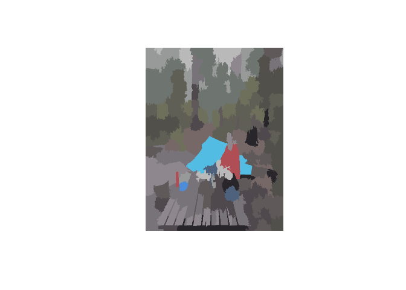

Schemr
------

`schemr` is an R package for turning your photos into usable colour
schemes for R visualisations.

The key driver is the `img_to_pallette` function, which:

-   reads in images;
-   finds colour blobs within the image, representing the key
    highlighting colours; and
-   uses affinity propagation clustering to condense the set of key
    colours.

### Example 1

First we have a look at a photo of me camping.

``` r
library(OpenImageR)
library(magrittr)

# Read in the image
image <- readImage(path = "Images/camping.jpg")

# Shrink down the image
new_height <- dim(image)[1] * 0.4
new_width <- dim(image)[2] * 0.4
image %<>% resizeImage(image = ., width = new_width, height = new_height)

# Plot
plot(as.raster(image))
```


We see big blobs of blue and orange. Using schemr to extract these, we
get:

``` r
library(schemr)

# Extract key colours from image
schemr_image <- img_to_pallette(image_path = "Images/camping.jpg", resize_factor = 0.4,
                                verbose = FALSE)
```

    ## WARNING: The input data has values between 0.000000 and 1.000000. The image-data will be multiplied by the value: 255!

``` r
# Plot the image
plot(schemr_image)
```



In addition, printing the class, shows the vector of hex RGB codes that
make up the clustered data:

``` r
schemr_image
```

    ##  [1] "#909692" "#747a72" "#66675b" "#5b5b52" "#686163" "#888187" "#787279"
    ##  [8] "#5b565b" "#aba8a8" "#707460" "#7b6d6a" "#a2575b" "#434249" "#6381bb"
    ## [15] "#57a6c3" "#5c718e"
